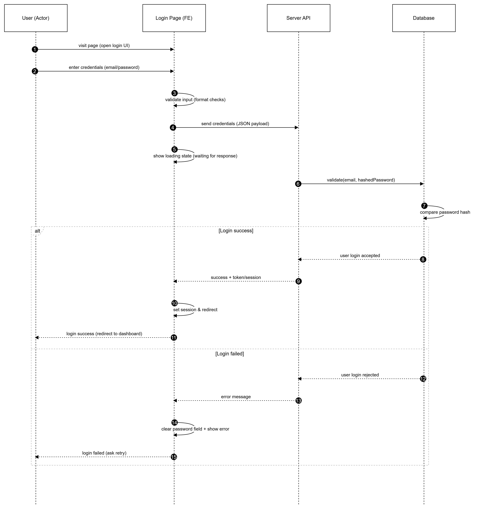

Bạn là Senior Developer.


Dựa trên toàn bộ thông tin tôi cung cấp bên dưới, hãy viết code hoàn chỉnh để thực hiện đúng theo sơ đồ luồng.


=== INPUT START ===


1. Sơ đồ luồng:

2. Dữ liệu (Models/DB/Interfaces):

- Bảng `users` trong PostgreSQL:

  - id (uuid, PK)
  - email (varchar, unique, not null)
  - password_hash (varchar, not null)
  - full_name (varchar, nullable)
  - is_active (boolean, default true)
  - failed_login_attempts (int, default 0)
  - created_at (timestamp)
  - updated_at (timestamp)

- DTO / Interface phía BE (TypeScript):

  ```ts
  export interface LoginRequestDto {
    email: string;
    password: string;
  }

  export interface LoginSuccessResponse {
    accessToken: string;
    refreshToken?: string;
    user: {
      id: string;
      email: string;
      fullName?: string;
    };
  }

  export interface LoginErrorResponse {
    errorCode: 'INVALID_CREDENTIALS' | 'USER_INACTIVE' | 'TOO_MANY_ATTEMPTS';
    message: string;
  }
Entity User (TypeORM):

ts
Copy code
@Entity('users')
export class User {
  @PrimaryGeneratedColumn('uuid')
  id: string;

  @Column({ unique: true })
  email: string;

  @Column()
  passwordHash: string;

  @Column({ nullable: true })
  fullName?: string;

  @Column({ default: true })
  isActive: boolean;

  @Column({ default: 0 })
  failedLoginAttempts: number;

  @CreateDateColumn()
  createdAt: Date;

  @UpdateDateColumn()
  updatedAt: Date;
}
API liên quan:

Endpoint login (REST):

POST /auth/login

Request body (JSON): LoginRequestDto

Response:

200 OK: LoginSuccessResponse

401 Unauthorized: LoginErrorResponse với errorCode = INVALID_CREDENTIALS

423 Locked: LoginErrorResponse với errorCode = TOO_MANY_ATTEMPTS

403 Forbidden: LoginErrorResponse với errorCode = USER_INACTIVE

Sau khi login thành công:

Trả về accessToken (JWT) trong body

(tuỳ chọn) Set cookie refresh_token HTTPOnly

Các function hiện có:

ts
Copy code
// So sánh mật khẩu plain text với passwordHash đã lưu
async function verifyPassword(plainPassword: string, passwordHash: string): Promise<boolean> {
  // Dùng bcrypt.compare hoặc thư viện tương đương
}

// Sinh JWT cho user
function generateAccessToken(user: User): string {
  // sign JWT với payload: { sub: user.id, email: user.email }
}

// Tăng số lần login sai
async function increaseFailedLoginAttempts(user: User): Promise<void> {
  // user.failedLoginAttempts++
  // nếu vượt quá 5 lần thì có thể khóa tạm thời
}

// Reset số lần login sai về 0
async function resetFailedLoginAttempts(user: User): Promise<void> {
  // user.failedLoginAttempts = 0
}
Công nghệ/Frameworks bắt buộc:

Backend:

NestJS (TypeScript)

TypeORM

PostgreSQL

JWT ( @nestjs/jwt )

Frontend (mức độ vừa phải, không cần quá chi tiết):

React + Axios

Sử dụng React Hook Form hoặc form tự viết để submit login

Lưu accessToken vào memory (hoặc localStorage) và redirect bằng React Router

=== INPUT END ===

=== OUTPUT REQUIREMENTS ===

Sinh code hoàn chỉnh theo đúng flow login trên:

Controller / Route POST /auth/login bên NestJS

Service AuthService.login() xử lý nghiệp vụ

Repository/Service lấy User từ DB

Xử lý cả nhánh success & failed, tăng/giảm failedLoginAttempts

Ví dụ code React FE cho form login + gọi API + xử lý redirect/error.

Đặt tên biến rõ nghĩa, thêm comment giải thích từng bước.

Mapping từng bước code ↔ step trong sơ đồ (ví dụ comment // Step 3: FE gửi credentials lên API).

Xử lý lỗi đầy đủ (validate input, user không tồn tại, sai mật khẩu, user bị khóa, quá số lần thử).

Tách file/module theo best practice NestJS (controller, service, module, entity, dto).

Gợi ý test cases (unit test cho AuthService, e2e test cho /auth/login) và checklist review cuối cùng.

Hãy output theo format:

CODE
[code]

GIẢI THÍCH LOGIC
[text]

CHECKLIST REVIEW
[bullet list]

TEST CASE GỢI Ý
[list]

=== END ===